# Ackermann GCS Planner 数据流与交互逻辑分析报告

> **版本**: 2.0.1  
> **分析日期**: 2026-04-18  
> **分析范围**: 端到端数据流、模块间交互协议、关键数据结构生命周期、错误传播路径

---

## 1. 引言

本报告从数据流视角分析 Ackermann GCS Planner 系统，追踪数据从输入到输出的完整生命周期，揭示模块间的交互协议和数据变换逻辑。与架构报告的静态结构视角和模块报告的算法视角不同，本报告关注数据的**动态流转**和**变换语义**。

---

## 2. 端到端数据流全景

### 2.1 主数据流

数据从输入到输出经历六个阶段，每个阶段对应系统的一层或一个后处理步骤：

**输入层**：障碍物地图（H×W 二值 numpy 数组）、起点/终点状态（x, y, θ）、机器人形状（RobotShape）、规划配置（PlannerConfig）

**L1 A*搜索**：障碍物地图和机器人形状生成 SE(2) C-space（H×W×Nθ 布尔数组），A* 在其中搜索得到粗路径（List[Tuple(x,y,θ)]）

**L2 走廊生成**：粗路径和机器人形状生成走廊掩码（H×W 布尔数组），调整 C-space 将走廊外设为障碍

**L3 凸分解**：调整后 C-space 和粗路径提取种子点，IRIS 膨胀生成凸区域列表（List[HPolyhedron]），覆盖验证生成覆盖报告

**L4 GCS优化**：凸区域构建 GCS 图（GraphOfConvexSets），求解松弛解，舍入得到整数路径，固定路径求解得到最优轨迹（BezierTrajectory）

**后处理**：轨迹经微分平坦映射得到车辆状态轨迹（x,y,θ,v,δ,a），评估器检查约束违反量生成 TrajectoryReport，最终组装为 PlanningResult

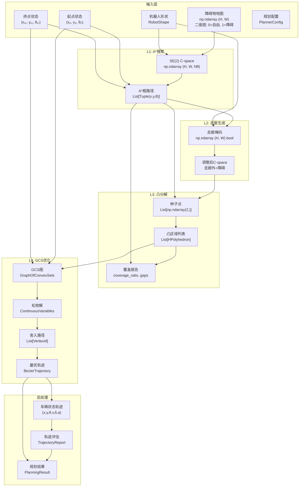

### 2.2 数据变换语义

每个层间传递涉及一次**语义变换**：

| 变换 | 输入语义 | 输出语义 | 信息损失 |
|------|----------|----------|----------|
| 障碍物地图 → C-space | 工作空间障碍 | 配置空间障碍（膨胀后） | 机器人几何信息被"烘焙"进C-space |
| C-space → A*路径 | 连续配置空间 | 离散路径点序列 | 连续性信息丢失，仅保留拓扑 |
| A*路径 → 走廊 | 全局路径 | 局部可行空间 | 全局信息被走廊边界截断 |
| 走廊 → 凸区域 | 非凸可行空间 | 凸区域并集 | 走廊边界可能被凸逼近截断 |
| 凸区域 → GCS图 | 几何区域 | 优化变量+约束 | 区域几何被抽象为顶点/边 |
| GCS图 → 轨迹 | 离散图结构 | 连续参数曲线 | 松弛+舍入引入近似 |
| 轨迹 → 车辆状态 | 平坦输出空间 | 车辆状态空间 | 无损（微分平坦映射是双射） |

---

## 3. 关键数据结构生命周期

### 3.1 障碍物地图

**生命周期**：原始二值地图（uint8）→ 距离场（float64，每个像素到最近障碍物的距离）→ 每个 θ 的 2D C-space 切片（bool）→ 堆叠为 3D SE(2) C-space（bool）→ 走廊调整后 C-space（走廊外置为障碍）

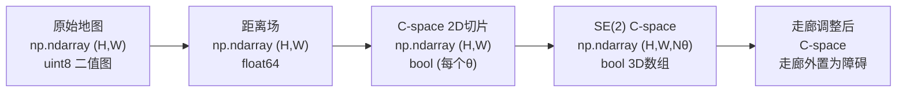

**内存分析**: 对于 100×100 地图、36个θ离散化，SE(2) C-space 占用 $100 \times 100 \times 36 = 360,000$ 字节（bool），距离场占用 $100 \times 100 \times 8 = 80,000$ 字节（float64）。

### 3.2 A* 搜索路径

**生命周期**：SearchNode 优先队列（按 cost 排序）→ 已访问集合（Dict[网格坐标, SearchNode]）→ 粗路径（通过父指针回溯得到 List[Tuple(x,y,θ)]）→ 平滑路径（移动平均滤波后）


**关键变换**: 离散网格坐标 $(g_x, g_y, g_\theta)$ → 连续坐标 $(x, y, \theta)$，通过 `resolution` 和 `origin` 参数映射。

### 3.3 凸区域

**生命周期**：种子点（2D 坐标，区域中心候选）→ HPolyhedron（A·x ≤ b，Drake 多面体表示）→ IrisNpRegion（包含 region + seed + volume + quality）→ 区域列表（覆盖路径的凸分解）

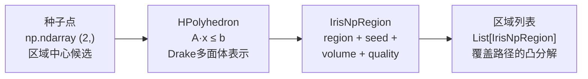

**HPolyhedron 表示**: $A \in \mathbb{R}^{m \times 2}$, $b \in \mathbb{R}^{m}$，其中 $m$ 为超平面数（即多面体面数）。IrisNp/IrisZo 算法通过迭代添加分离超平面来膨胀区域，$m$ 随迭代增加。

### 3.4 GCS 轨迹

**生命周期**：松弛解（Drake 内部的 ContinuousVariables）→ 舍入路径（整数顶点序列 List[VertexId]）→ 固定路径凸优化解（每段贝塞尔控制点）→ BezierTrajectory（path_traj + time_traj）→ 采样轨迹（等时间采样的 N×2 数组）

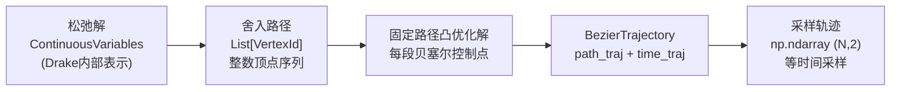

**BezierTrajectory 结构**:
- `path_traj`: 空间轨迹，贝塞尔曲线分段表示
- `time_traj`: 时间缩放轨迹，将参数 $s \in [0,1]$ 映射到物理时间 $t$
- `invert_time_traj`: 时间反函数 $t \to s$，用于等时间采样

### 3.5 PlanningResult

**组装过程**：BezierTrajectory + TrajectoryReport（约束违反量）+ FlatOutputMapping（x,y,θ,v,δ,a）+ solve_time + convergence_reason → PlanningResult

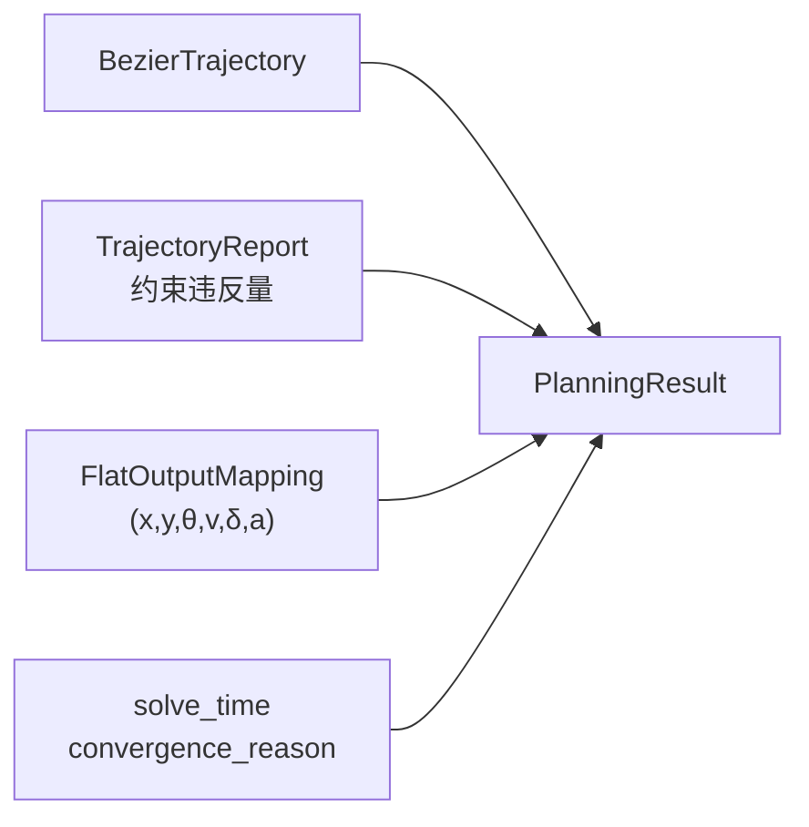

---

## 4. 模块间交互协议

### 4.1 A* → 走廊生成

**交互过程**：A* 搜索将粗路径（List[Tuple(x,y,θ)]）和机器人形状（RobotShape）传递给 CorridorGenerator.generate_corridor()。走廊生成器内部依次执行路径平滑、走廊掩码生成和 C-space 调整，返回 CorridorResult（包含调整后 C-space、走廊掩码、走廊面积和缩减比）。

**交互契约**:
- **前置条件**: `path` 非空且每个点在自由空间内
- **后置条件**: `corridor_mask` 覆盖 `path` 的所有点
- **不变量**: `corridor_area <= original_free_area`

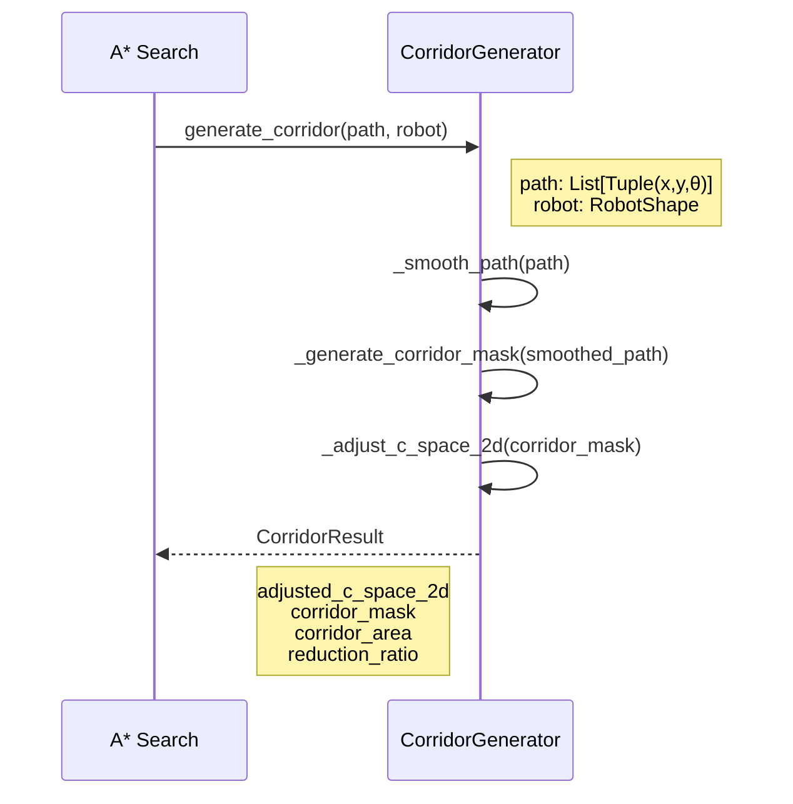

### 4.2 走廊 → IRIS 凸分解

**交互过程**：CorridorGenerator 调用 IrisRegionGenerator.generate_from_path()，传入路径、障碍物地图、分辨率和原点。IRIS 生成器内部依次创建碰撞检测器、定义搜索域、提取种子点，然后调用 IrisNpProcessor 处理种子点生成区域，再调用 CoverageChecker 验证覆盖。若未完全覆盖，则为未覆盖点生成额外区域并再次验证。最终返回 IrisNpResult。

**交互契约**:
- **前置条件**: `obstacle_map` 与 `path` 坐标系一致
- **后置条件**: `coverage_ratio >= target_coverage`（通常 > 0.95）
- **容错**: 若三轮扩张后仍未完全覆盖，返回部分覆盖结果并标记

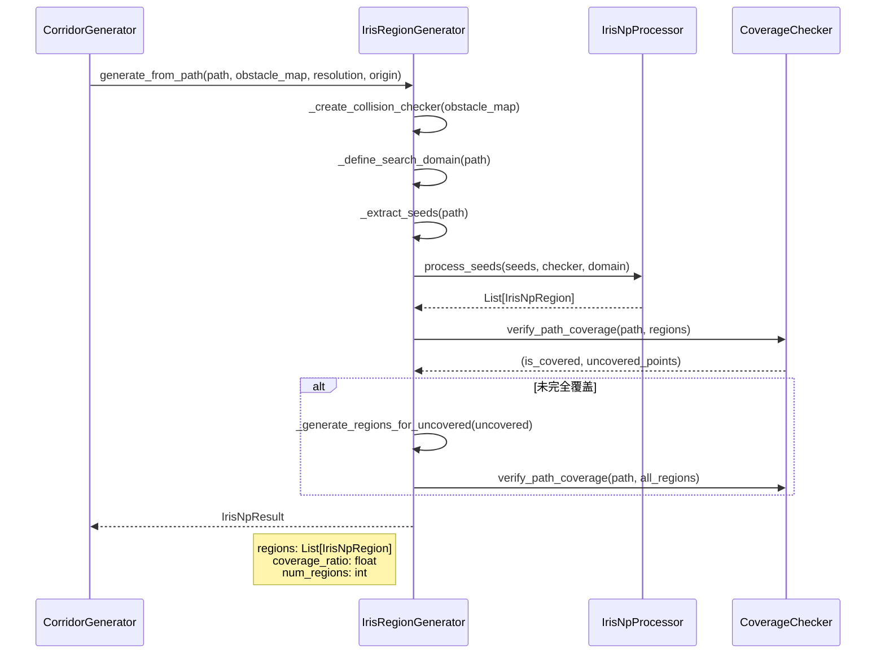

### 4.3 IRIS → GCS 优化

**交互过程**：IRIS 引擎将包含凸区域列表（List[HPolyhedron]）的结果传递给 GCSOptimizer.optimize()。优化器优先尝试阿克曼模式：构建 AckermannBezierGCS，依次添加起终点、速度限制、曲率约束和成本函数，然后调用 solveGCS 求解。若阿克曼模式失败，回退到 2D 模式构建 BezierGCS 求解。返回成功标志。

**交互契约**:
- **前置条件**: `regions` 非空且形成连通图（通过 `findEdgesViaOverlaps`）
- **后置条件**: 若成功，`trajectory` 满足所有硬约束（速度、曲率）
- **容错**: 阿克曼模式失败时自动降级为2D模式

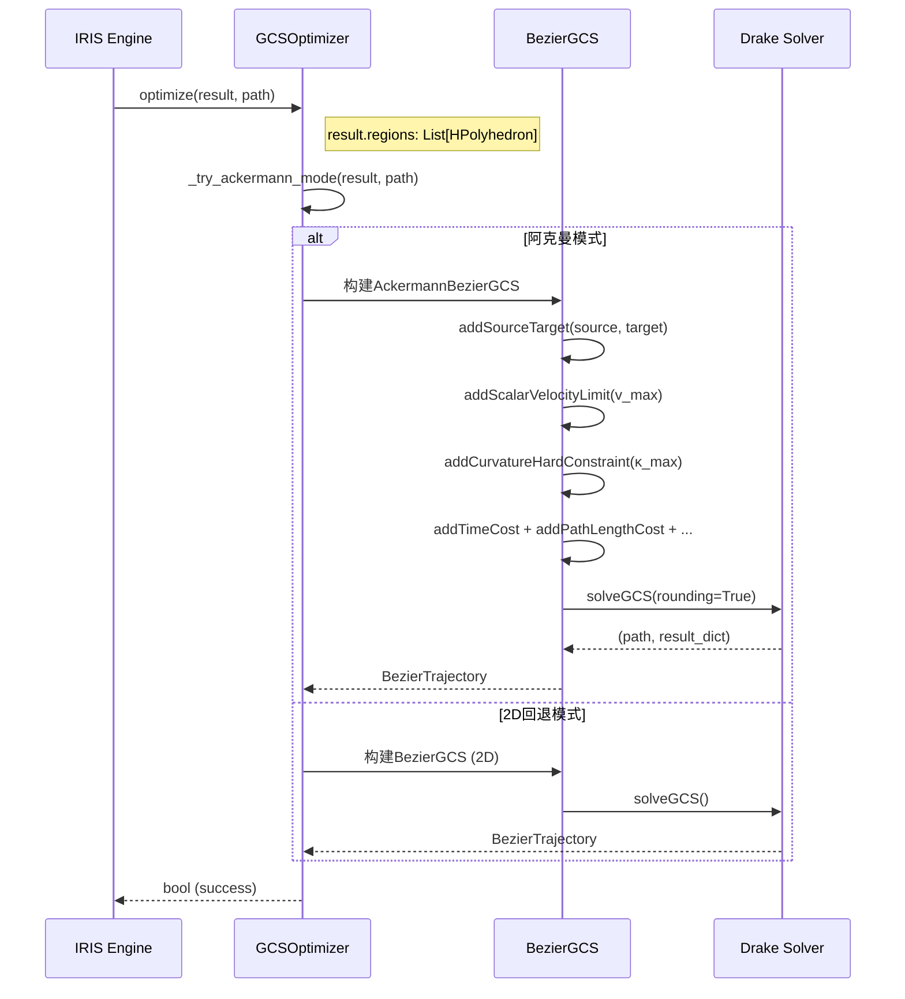

### 4.4 GCS → 微分平坦映射 → 评估

**交互过程**：GCS 优化器将 BezierTrajectory 传递给 FlatOutputMapper，计算位置、速度、航向角、曲率、转向角、加速度的完整映射；然后将轨迹和约束传递给 TrajectoryEvaluator，检查速度/加速度/曲率/工作空间/连续性违反量；最终组装为 PlanningResult。

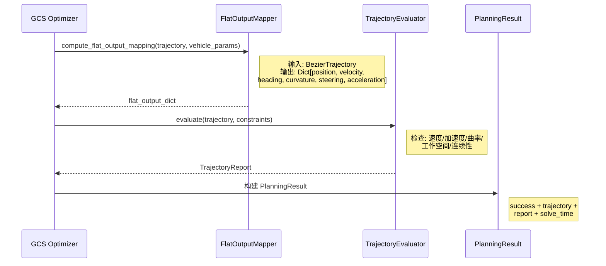

---

## 5. 错误传播与恢复路径

### 5.1 错误传播图

**错误与恢复全景**：系统定义了9种错误场景和对应的恢复策略：

- **A*搜索失败**（无可行路径）→ 不可恢复，规划完全失败
- **走廊生成失败**（路径穿越障碍）→ 回退到使用原始 C-space，不生成走廊
- **IrisZo失败**（收敛异常）→ 回退到 IrisNp，或进一步回退到传统 OpenCV 分解
- **IrisNp失败**（Drake异常）→ 回退到传统 OpenCV 分解
- **覆盖验证失败**（覆盖率<阈值）→ 触发第三轮补充扩张，可能循环直到覆盖或达到上限
- **GCS图不连通**（区域间无交集）→ 警告并降级为2D模式
- **阿克曼GCS求解失败**（SOCP不可行）→ 回退到2D BezierGCS
- **2D GCS求解失败**（无可行解）→ 规划失败，返回部分结果
- **轨迹评估不通过**（约束违反）→ 返回轨迹+违反报告，由用户决定是否接受

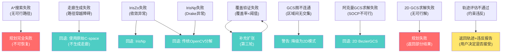

### 5.2 恢复策略分级

| 级别 | 策略 | 示例 |
|------|------|------|
| L0: 完全失败 | 无恢复，返回错误 | A*无可行路径 |
| L1: 降级求解 | 使用更简单但更鲁棒的算法 | IrisZo → IrisNp → OpenCV |
| L2: 补充计算 | 增加计算量填补覆盖间隙 | 第三轮IRIS扩张 |
| L3: 放松约束 | 接受近似可行解 | 违反量 < ε 的轨迹 |
| L4: 部分返回 | 返回部分结果供用户判断 | 轨迹+违反报告 |

---

## 6. 配置数据流

### 6.1 配置传播路径

**配置分发逻辑**：用户提供的 PlannerConfig 作为唯一配置入口，向下派生出六组子配置——走廊参数（corridor_* 前缀）、IRIS 参数（iris_* 前缀，进一步选择 IrisNpConfig 或 IrisZoConfig 并应用安全模板）、GCS 参数（gcs_* 前缀，进一步应用策略预设和成本预设）、阿克曼参数（ackermann_* 前缀，推导出 VehicleParams 和 TrajectoryConstraints）、求解器配置（solver_* 前缀，选择 MOSEK/Gurobi/CLP/SCS）、可视化配置（visualization_* 前缀）。

GCS 策略预设和成本预设最终作用于 BezierGCS 配置；阿克曼参数作用于 AckermannBezierGCS 配置；求解器配置决定实际使用的凸优化求解器。

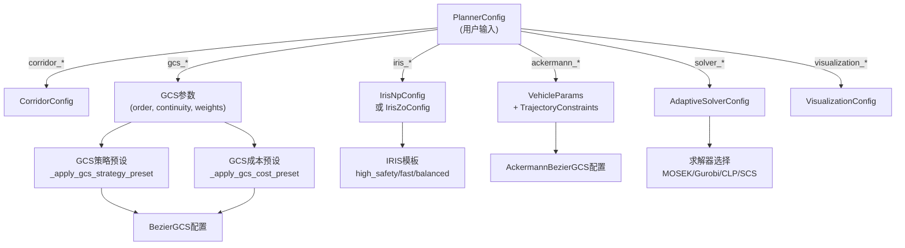

### 6.2 预设覆盖机制

配置系统采用**预设-覆盖**（Preset-Override）两级机制：

1. **预设层**: 根据场景选择预设（如 `lunar_standard` 成本预设），填充一组默认参数
2. **覆盖层**: 用户显式指定的参数覆盖预设值

```python
# 伪代码示意
config = PlannerConfig()
config._apply_gcs_strategy_preset("standard")  # 预设填充
config.gcs_time_weight = 0.5                    # 用户覆盖
```

**覆盖优先级**: 用户显式值 > 预设值 > 硬编码默认值

---

## 7. 可视化数据流

### 7.1 可视化数据提取

**数据提取逻辑**：PlanningResult 中的 regions（凸区域列表）被渲染为 2D 多边形；trajectory（BezierTrajectory）被分别绘制为 2D 轨迹曲线（x,y 平面）、3D 轨迹曲线（x,y,θ 空间）和轮廓曲线（v(t), κ(t), δ(t) 随时间变化）。所有图形通过 OutputManager 统一管理输出路径，最终写入文件系统的 output/2d/ 或 output/3d/ 目录。

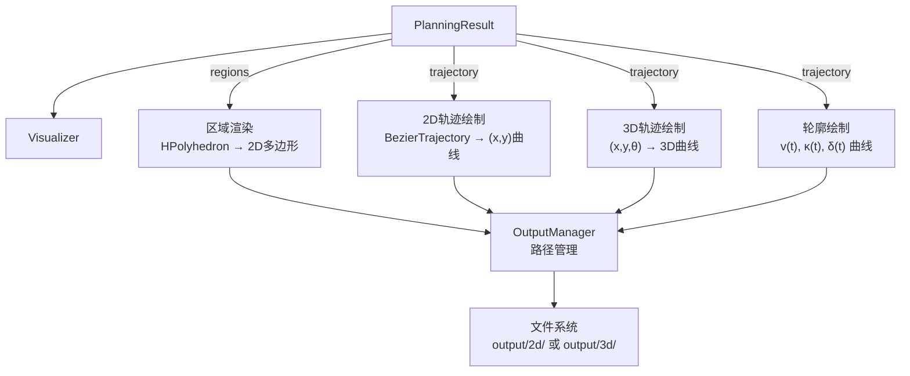

### 7.2 输出路径构建

```
output/
├── 2d/
│   ├── {run_id}/
│   │   ├── trajectory_2d.png
│   │   ├── velocity_profile.png
│   │   ├── curvature_profile.png
│   │   └── regions.png
└── 3d/
    └── {run_id}/
        └── trajectory_3d.png
```

---

## 8. 性能数据流

### 8.1 性能监测数据结构

**核心数据结构**：

- **PerformanceMetrics**：单阶段性能指标，包含阶段名、墙钟时间、CPU时间、内存增量、CPU平均使用率、子阶段列表（递归结构）、起始时间和起始内存
- **PerformanceMonitor**：性能监测器，维护一个指标栈（`_metrics_stack`）用于嵌套追踪，和一个已完成指标字典（`_completed_metrics`）用于按名称查询。提供 start/end 方法和 track 上下文管理器，支持生成文本报告和导出 JSON

PerformanceMetrics 的 sub_stages 字段引用自身类型，形成树形嵌套结构。

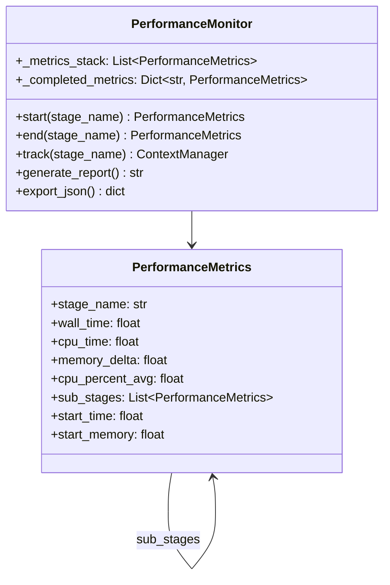

### 8.2 性能数据采集点

| 采集点 | 层级 | 关键指标 |
|--------|------|----------|
| `corridor_generation` | L2 | 走廊面积、缩减比 |
| `iris_decomposition` | L3 | 区域数、覆盖率、膨胀时间 |
| `seed_extraction` | L3 | 种子点数 |
| `region_expansion` | L3 | 单区域膨胀迭代数 |
| `coverage_validation` | L3 | 覆盖率、未覆盖点数 |
| `gcs_optimization` | L4 | 求解时间、舍入次数 |
| `problem_construction` | L4 | 顶点数、边数、变量数 |
| `solving` | L4 | 求解器迭代数、对偶间隙 |

---

## 9. 关键交互时序

### 9.1 完整规划时序

**完整规划流程的时序描述**：

1. 用户脚本调用 HybridAStarGCSPlanner.process(astar_path, robot)
2. **Phase 1**：调用 CorridorGenerator 生成走廊，返回 CorridorResult
3. **Phase 2**：优先调用 IrisZoRegionGenerator；若失败，回退到 IrisNpRegionGenerator；若仍失败，回退到传统 OpenCV 凸分解
4. **Phase 3**：优先调用 AckermannGCSPlanner.plan_trajectory()；若成功，执行 FlatOutputMapper 和 TrajectoryEvaluator；若失败，回退到 2D BezierGCS
5. **Phase 4**：调用 Visualizer 输出图形
6. 返回 PlannerResult

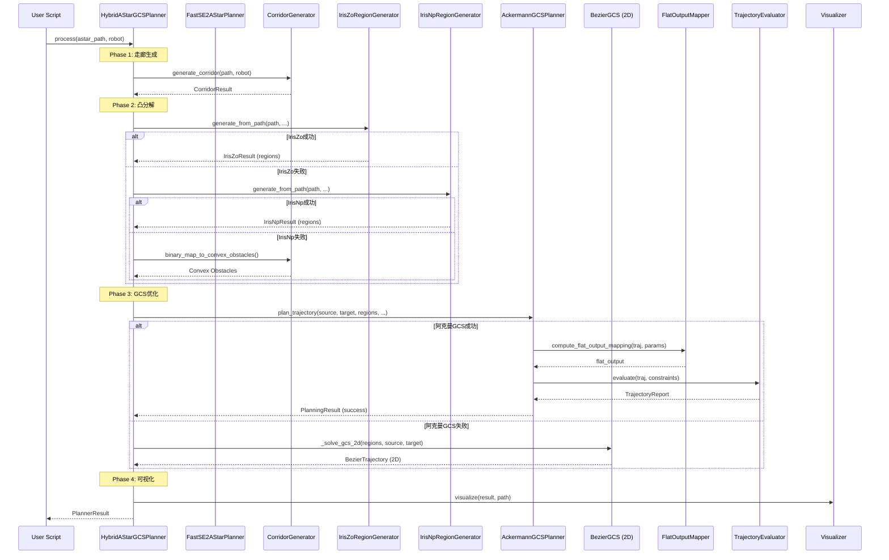

### 9.2 IRIS 区域生成详细时序

**IRIS 区域生成的详细时序描述**：

1. HybridAStarGCSPlanner 调用 IrisNpRegionGenerator.generate_from_path()
2. 生成器调用 SeedExtractor 从路径提取种子点
3. **第一批扩张**：调用 IrisNpProcessor.process_seeds()，对每个种子点调用 IrisNpExpansion.expand() 生成区域
4. 调用 CoverageChecker 验证覆盖，发现未覆盖点
5. **第二批扩张**：从未覆盖点提取额外种子点，再次调用 Processor 生成区域
6. 再次验证覆盖，确认覆盖率达到 0.98
7. **区域修剪**：调用 RegionPruner.prune() 移除冗余区域
8. 返回 IrisNpResult

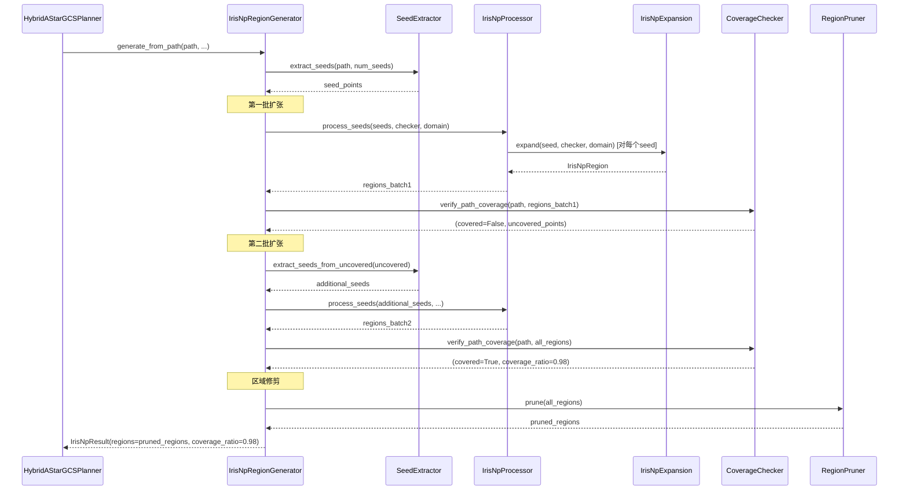

---

## 10. 数据一致性约束

### 10.1 坐标系一致性

系统中存在两套坐标表示，必须保持一致：

| 表示 | 格式 | 使用模块 | 转换关系 |
|------|------|----------|----------|
| 像素坐标 | `(px, py)` int | C_space_pkg, IRIS | `x = (px - origin_x) * resolution` |
| 世界坐标 | `(x, y)` float | A_pkg, GCS, 可视化 | `px = int((x - origin_x) / resolution)` |

**一致性约束**: `origin` 和 `resolution` 参数在所有模块间必须一致传递。

### 10.2 区域连通性约束

GCS求解要求凸区域图是连通的：

$$\forall i, j \in \text{path}: \exists \text{ path in GCS graph from } v_i \text{ to } v_j$$

该约束通过 `findEdgesViaOverlaps` 验证：两个区域有边当且仅当它们的交集维度 $\geq d-1$（满维交集）。

**含义**：路径上的任意两个区域之间，必须存在一条由区域交集连接的通路，否则 GCS 无法找到从起点到终点的可行路径。

### 10.3 覆盖完整性约束

IRIS生成的凸区域必须覆盖A*路径：

$$\text{path} \subseteq \bigcup_{i=1}^{N} \mathcal{R}_i$$

该约束通过 `CoverageChecker.verify_path_coverage` 验证。若不满足，触发补充扩张。

**含义**：A* 路径上的每一个点都必须至少被一个凸区域包含，否则该点对应的轨迹段无法在 GCS 中表示。

---

## 11. 结论

Ackermann GCS Planner 的数据流呈现清晰的**漏斗形**特征：从高维非凸的输入空间（SE(2)配置空间 + 阿克曼动力学约束），逐层降维和凸化，最终收敛到低维凸优化问题（SOCP）的解。每一层的数据变换都伴随着信息损失，但通过层间的交互协议（前置/后置条件）和错误恢复机制（优先-回退策略），系统在信息损失和计算可行性之间取得了工程上的平衡。

数据流的核心挑战在于**层间信息损失的控制**：A*路径的离散化损失了连续性信息，走廊生成截断了全局信息，凸分解引入了逼近误差，GCS松弛+舍入引入了近似误差。这些误差的累积效应通过轨迹评估器进行事后检验，但缺乏事前的误差传播分析。这是未来改进的一个重要方向。
