# Ackermann GCS Planner 核心模块深度分析报告

> **版本**: 2.0.1  
> **分析日期**: 2026-04-18  
> **分析范围**: 六大核心模块的内部机制、算法原理、数据结构与设计模式

---

## 1. 引言

本报告对 Ackermann GCS Planner 的六大核心模块进行深度内部分析，聚焦于每个模块的算法原理、关键数据结构、内部协作机制以及设计模式的运用。与架构报告的宏观视角不同，本报告采用微观视角，深入模块内部逻辑。

---

## 2. A* 搜索模块 (`A_pkg`)

### 2.1 模块概述

A* 搜索模块在 SE(2) 配置空间（位置 + 航向角）中执行全局路径搜索，为后续走廊生成提供拓扑可行的粗路径。该模块实现了两种搜索策略：带跳跃点优化的快速A*和双向A*。

### 2.2 核心数据结构

A* 模块围绕以下核心数据结构组织：

- **SearchNode**：A* 搜索节点，包含位姿 `(x, y, theta)`、代价 `cost = g_cost + h_cost`、父指针和搜索方向。支持 `<` 比较运算用于优先队列排序。
- **ReedsSheppSegment**：运动基元段，由转向方向 `steer`（-1左/0直/1右）、档位 `gear`（+1前进/-1倒车）和长度组成。
- **PlannerConfig**：搜索参数配置，包括最大迭代数、目标容差、启发式权重、角度离散化分辨率等。
- **BaseSE2Planner**：抽象基类，持有配置、C-space 引用和碰撞缓存，定义 `plan()` 抽象方法和运动基元生成、碰撞检测、启发式计算等模板方法。
- **FastSE2AStarPlanner**：快速A*实现，增加跳跃点搜索相关方法。
- **BidirectionalSE2AStarPlanner**：双向A*实现，增加双向扩展和路径合并方法。

继承关系：`FastSE2AStarPlanner` 和 `BidirectionalSE2AStarPlanner` 均继承自 `BaseSE2Planner`。

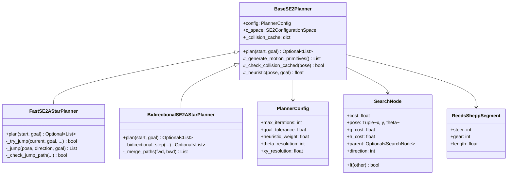

### 2.3 运动基元生成

运动基元基于 **Reeds-Shepp 车盖模型**，生成离散化的运动方向集合：

| 基元类型 | steer 值 | gear 值 | 物理含义 |
|----------|----------|---------|----------|
| 直行前进 | 0 | +1 | 零转向角前进 |
| 直行倒车 | 0 | -1 | 零转向角后退 |
| 左转前进 | +1 | +1 | 正转向角前进 |
| 左转倒车 | +1 | -1 | 正转向角后退 |
| 右转前进 | -1 | +1 | 负转向角前进 |
| 右转倒车 | -1 | -1 | 负转向角后退 |

### 2.4 跳跃点搜索优化

`FastSE2AStarPlanner` 的核心优化是**自适应跳跃点搜索**（Adaptive Jump Point Search）：

**算法逻辑**：从当前节点出发，根据到目标的距离自适应选择跳跃倍数——距离小于5m时保守跳跃（倍数1、2），5~15m时中等跳跃（倍数2、3），大于15m时大胆跳跃（倍数2、3、4）。沿当前运动方向跳跃N步后，对跳跃路径进行多点采样碰撞检测：若整条跳跃路径无碰撞，则接受跳跃节点并跳过中间所有节点；若存在碰撞，则回退到常规单步扩展。

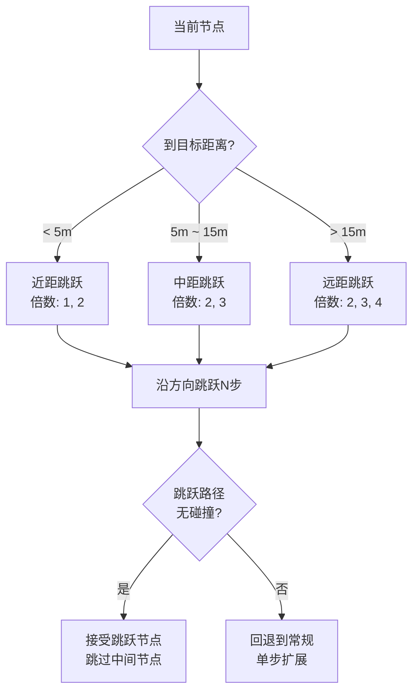

**设计权衡**: 跳跃倍数过大会增加碰撞检测的采样密度（多点采样验证），过小则退化为常规A*。自适应策略根据距离动态调整，在远距离时大胆跳跃以加速搜索，近距离时保守步进以保证精度。

### 2.5 双向搜索策略

`BidirectionalSE2AStarPlanner` 从起点和终点同时扩展搜索树：

- **前向搜索**：从起点向终点扩展
- **反向搜索**：从终点向起点扩展（运动基元取反）
- **相遇判定**：当一方的扩展节点出现在另一方的已访问集合中时，搜索终止
- **路径合并**：通过父指针回溯前向和反向路径，在相遇点拼接

**共享资源**: 两个搜索方向共享碰撞检测缓存 `_collision_cache`，避免重复计算。

---

## 3. 配置空间模块 (`C_space_pkg`)

### 3.1 模块概述

配置空间模块负责将工作空间中的障碍物映射到考虑机器人几何的配置空间，并基于A*路径生成局部走廊。

### 3.2 SE(2) 配置空间生成

**生成流程**：从2D障碍物地图出发，先通过 scipy 距离场变换计算每个像素到最近障碍物的距离；然后对每个离散化的航向角 θ 切片，将机器人形状旋转到对应角度，根据形状类型选择不同的碰撞检测策略——圆形用外接圆膨胀（O(1)操作），矩形用 Numba JIT 加速的并行碰撞检测，多边形用精确的 Minkowski 和计算；每个 θ 切片生成一个 2D C-space 布尔图，最终堆叠为 3D SE(2) C-space 数组。

```mermaid
flowchart TD
    A[2D障碍物地图] --> B[距离场变换<br/>scipy.distance_transform_edt]
    B --> C[对每个theta切片]
    C --> D[机器人形状旋转]
    D --> E{形状类型?}
    E -->|圆形| F[外接圆膨胀<br/>O(1)操作]
    E -->|矩形| G[Numba JIT加速<br/>并行碰撞检测]
    E -->|多边形| H[精确碰撞检测<br/>Minkowski和]
    
    F --> I[2D C-space切片]
    G --> I
    H --> I
    I --> J[堆叠为3D SE2 C-space]
```

### 3.3 两级距离场筛选

碰撞检测的核心优化是**两级距离场筛选**：

$$d_{inscribed} \leq d(p, \mathcal{O}) \leq d_{circumscribed}$$

| 条件 | 判定 | 计算量 |
|------|------|--------|
| $d(p, \mathcal{O}) > r_{circumscribed}$ | 无碰撞（快速排除） | O(1) 查表 |
| $d(p, \mathcal{O}) < r_{inscribed}$ | 有碰撞（快速确认） | O(1) 查表 |
| $r_{inscribed} \leq d(p, \mathcal{O}) \leq r_{circumscribed}$ | 需精确检测 | O(n) 顶点检测 |

其中 $r_{circumscribed}$ 为机器人外接圆半径，$r_{inscribed}$ 为内切圆半径。

### 3.4 走廊生成算法

**生成流程**：A*粗路径先经过移动平均平滑处理，然后逐段生成以路径段为中心、以 `corridor_width` 为宽度的带状掩码；所有段掩码合并后，通过形态学操作提取边界；最后将走廊外的C-space区域设为障碍，得到调整后的局部C-space，并统计走廊面积和缩减比。


走廊生成的关键参数是 `corridor_width`，它决定了带状区域的宽度。该参数面临以下权衡：
- **过窄**：IRIS区域可能无法覆盖走廊边界，导致路径覆盖失败
- **过宽**：走廊包含过多障碍物，增加凸分解的复杂度

---

## 4. IRIS 凸区域生成模块 (`iris_pkg` / `iriszo`)

### 4.1 双引擎架构

系统提供两种IRIS实现，共享相同的外部接口 `generate_from_path(path, obstacle_map, resolution, origin)`：

- **IrisNpRegionGenerator**：基于 Drake 内置 IrisNp，支持两批扩张、单批扩张和 Voronoi 优化三种模式
- **IrisZoRegionGenerator**：基于自定义零阶优化算法，支持种子点处理和未覆盖段识别

两者通过接口一致性设计，可在 `HybridAStarGCSPlanner` 中无缝切换。

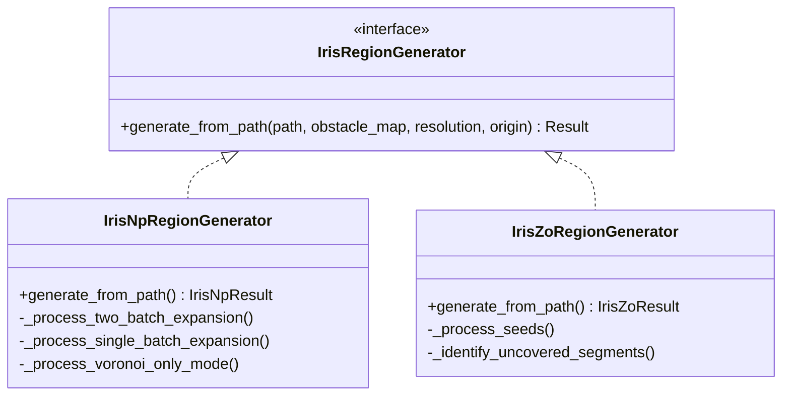

### 4.2 IrisNp 算法流程（三批扩张模式）

**完整流程**：输入路径和障碍物地图后，首先创建碰撞检测器和搜索域（HPolyhedron），然后沿路径均匀采样提取种子点。第一批扩张对种子点执行标准 IrisNp 膨胀和 Voronoi 优化；覆盖验证后若未完全覆盖，第二批扩张针对未覆盖点使用各向异性膨胀填补间隙；若仍有未覆盖点，第三轮对孤立点聚类生成小区域。最后执行区域修剪移除冗余区域，输出 IrisNpResult。

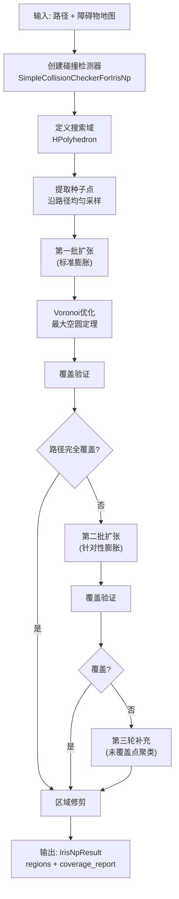

**三批扩张的设计逻辑**：
1. **第一批**：沿路径均匀采样种子点，使用标准IrisNp膨胀，快速建立基础覆盖
2. **第二批**：检查未覆盖点，使用各向异性膨胀（考虑路径切线方向），针对性填补覆盖间隙
3. **第三轮**：对仍未覆盖的孤立点进行聚类，为每个聚类生成小区域

### 4.3 IrisZo 算法流程（零阶优化）

IrisZo 基于**零阶优化**（Zero-Order Optimization）从零实现，不依赖Drake的IrisNp：

**算法流程**：初始化多面体 P 为搜索域、内接椭球 E 为起始椭球体。在外迭代循环中：先用 Hit-and-Run 采样器在 P 内均匀采样 N 个点，对每个采样点执行碰撞检测；若碰撞比例低于阈值则终止返回 P；否则对碰撞点执行二分搜索找到边界碰撞点，生成分离超平面将碰撞点排除，更新多面体 P = P ∩ {x: a^Tx ≤ b}，计算新的最大内接椭球 E，继续迭代。

```mermaid
flowchart TD
    A[初始化: P = 搜索域<br/>E = 起始椭球体] --> B[外迭代循环]

    B --> C[Hit-and-Run采样<br/>在P内均匀采样N个点]
    C --> D[碰撞检测<br/>对每个采样点检查]
    D --> E{碰撞比例 < 阈值?}
    E -->|是| F[终止: 返回P]
    E -->|否| G[对碰撞点执行<br/>二分搜索]
    
    G --> H[二分搜索<br/>找到边界碰撞点]
    H --> I[生成分离超平面<br/>将碰撞点排除]
    I --> J[更新多面体P<br/>P = P ∩ {x: a^T x <= b}]
    J --> K[计算最大内接椭球E]
    K --> B
```

**IrisZo vs IrisNp 对比**：

| 特性 | IrisNp | IrisZo |
|------|--------|--------|
| 实现来源 | Drake内置 | 自定义实现 |
| 优化方法 | 一阶（梯度） | 零阶（采样） |
| 收敛速度 | 快（二次收敛） | 慢（线性收敛） |
| 灵活性 | 低（Drake黑盒） | 高（可定制终止条件、采样策略） |
| 覆盖验证 | 后处理 | 内嵌增强版 |
| 适用场景 | 标准问题 | 非标准问题/调试 |

### 4.4 区域修剪算法

**修剪流程**：输入凸区域列表后，首先构建 RTree 空间索引；对每个区域 R_i，通过 RTree 查询与其有空间重叠的候选区域；然后在 R_i 内通过拒绝采样生成随机点，检查这些点是否被其他候选区域的并集覆盖；若所有采样点均被覆盖，则标记 R_i 为冗余；最后移除所有冗余区域，输出修剪后的区域列表。

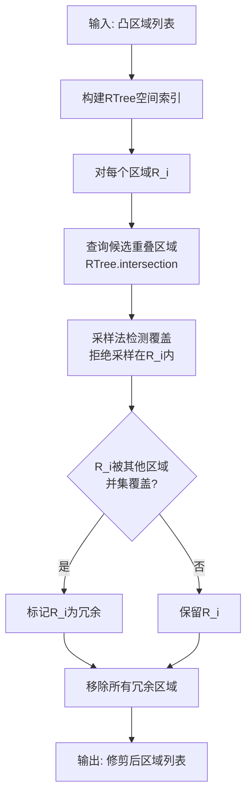

**采样法覆盖检测**：在区域 $R_i$ 内通过拒绝采样生成 $N$ 个随机点，检查每个点是否被其他区域的并集包含。若所有采样点均被覆盖，则判定 $R_i$ 冗余。该方法在概率意义上是正确的，采样数 $N$ 越大，置信度越高。

---

## 5. GCS 框架模块 (`gcs_pkg`)

### 5.1 模块概述

GCS（Graph of Convex Sets）框架是系统的核心求解引擎，将凸区域图上的最短路径问题建模为混合整数凸优化，通过松弛+舍入策略高效求解。

### 5.2 类继承体系

GCS 框架采用三层继承体系：

- **BaseGCS**：基类，封装 Drake 的 GraphOfConvexSets，提供顶点/边管理、重叠检测（`findEdgesViaOverlaps`）、舍入策略设置（`setRoundingStrategy`）和求解入口（`solveGCS`）
- **LinearGCS**：继承 BaseGCS，实现线性路径表示，添加时间成本和路径长度成本
- **BezierGCS**：继承 BaseGCS，实现贝塞尔曲线路径表示，添加时间/路径长度/能量成本、标量速度限制和曲率硬约束
- **AckermannBezierGCS**：继承 BezierGCS，添加阿克曼车辆特有的航向角约束和转弯半径约束

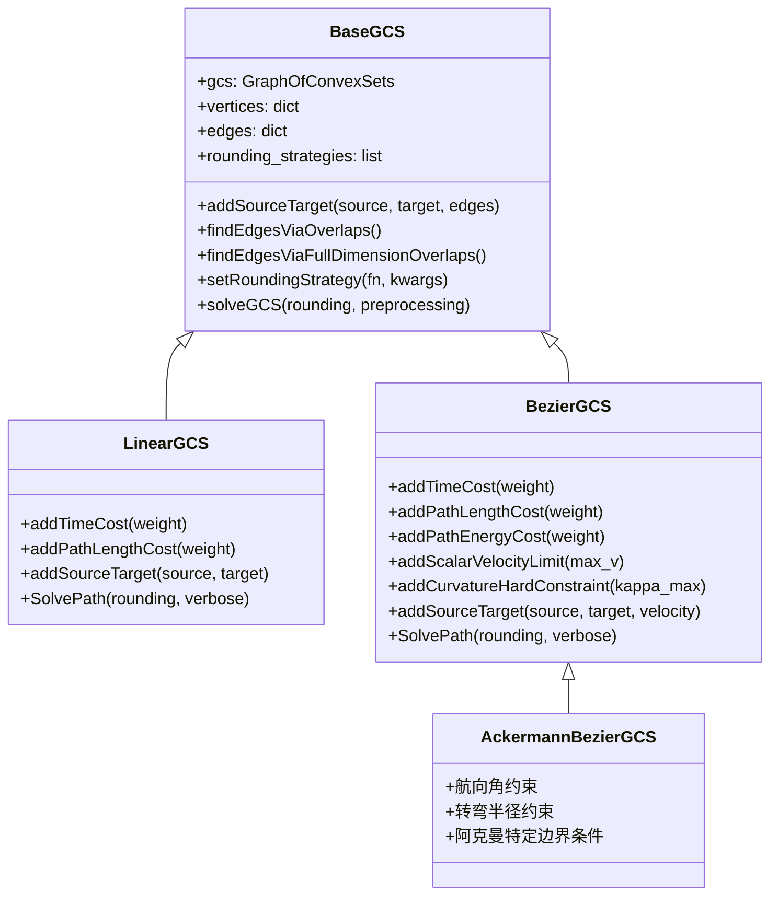

### 5.3 GCS 求解流程

**求解流程**：客户端调用 `solveGCS()` 后，BaseGCS 首先通过 Drake 求解松弛问题（SOCP/SDP），得到连续松弛解。若启用舍入，则对每个配置的舍入策略依次执行：舍入模块从松弛解中提取整数路径，BaseGCS 固定该路径的 Phi 约束后再次调用 Drake 求解凸优化，得到该路径上的最优轨迹。所有舍入路径求解完成后，选择成本最低的路径作为最终结果返回。

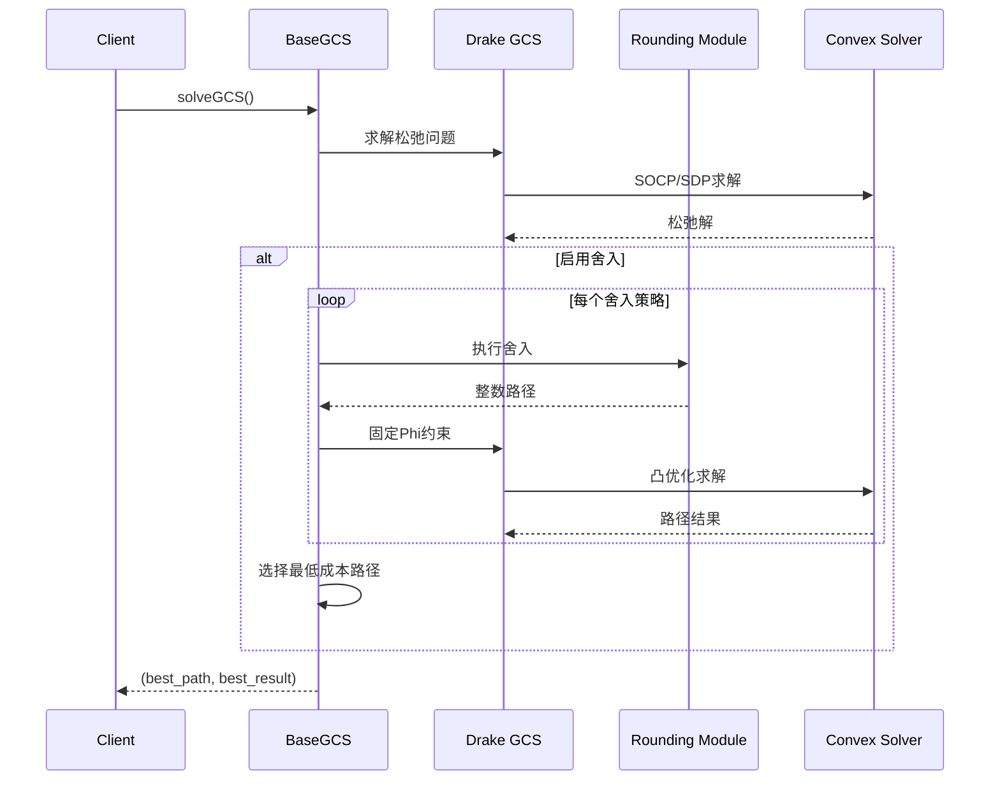

### 5.4 贝塞尔曲线约束体系

BezierGCS 的核心是将轨迹规划约束转化为凸约束：

#### 5.4.1 顶点凸集构造

每个GCS顶点的凸集为：

$$\mathcal{V}_i = \mathcal{R}_i^{d+1} \times \mathcal{T}_i$$

其中 $\mathcal{R}_i$ 为凸区域（HPolyhedron），$d$ 为贝塞尔阶数，$\mathcal{T}_i$ 为时间缩放集。

**含义**：每个顶点包含 (d+1) 个贝塞尔控制点（每个控制点必须在凸区域 $\mathcal{R}_i$ 内）和一个时间缩放变量，共同构成该顶点的优化变量空间。

#### 5.4.2 连续性约束

| 连续性阶数 | 约束条件 | 物理含义 |
|------------|----------|----------|
| C0 | $B_i(1) = B_{i+1}(0)$ | 位置连续 |
| C1 | $B_i'(1) = B_{i+1}'(0)$ | 速度连续（切线方向一致） |
| C2 | $B_i''(1) = B_{i+1}''(0)$ | 加速度连续（曲率连续） |

#### 5.4.3 曲率硬约束（Lorentz 锥松弛）

曲率约束 $\kappa \leq \kappa_{max}$ 的原始形式是非凸的。通过引入辅助变量和Lorentz锥松弛：

$$\|Q_j\|_2 \leq C = \kappa_{max} \cdot \rho_{min}^2$$

其中 $Q_j$ 为贝塞尔曲线二阶导数的控制点，$C$ 为由最大曲率和最小转弯半径决定的常数。该约束可表示为二阶锥约束（SOCP），在Drake中通过 `LorentzConeConstraint` 实现。

**松弛含义**：将非凸的曲率约束近似为凸的二阶锥约束，$Q_j$ 的 L2 范数被约束在常数 $C$ 以内，保证了贝塞尔曲线二阶导数控制点的大小受控，从而间接限制曲率。

#### 5.4.4 标量速度约束

$$\|r'(s)\|_2 \leq v_{max} \cdot h'(s)$$

同样通过Lorentz锥约束实现，其中 $r(s)$ 为位置轨迹，$h(s)$ 为时间缩放函数。

**含义**：位置轨迹的导数范数（速度大小）不超过最大速度乘以时间缩放函数的导数，确保车辆速度在物理限制内。

### 5.5 舍入策略

**舍入流程**：GCS 松弛解可能选择多个顶点的凸组合（非整数解），需要舍入将其投影到可行整数路径上。系统提供三种舍入策略：随机前向搜索（从源点贪心前进）、随机后向搜索（从目标点贪心后退）、MIP 路径提取（混合整数规划精确求解）。舍入得到整数路径后，固定 Phi 约束进行二次凸优化，得到该路径上的可行轨迹。

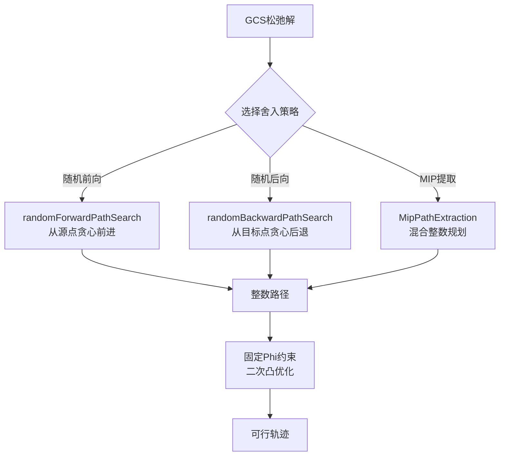

**舍入的必要性**：GCS松弛解可能选择多个顶点的凸组合（非整数解），舍入将其投影到可行整数路径上，再在固定路径上求解凸优化获得最优轨迹。

---

## 6. 阿克曼 GCS 规划模块 (`ackermann_gcs_pkg`)

### 6.1 模块概述

阿克曼GCS规划模块是系统的最高层规划入口，整合GCS框架、微分平坦映射和轨迹评估，为阿克曼转向车辆生成动力学可行的最优轨迹。

### 6.2 规划流程（8步）

**8步规划流程**：从车辆参数推导轨迹约束 → 初始化 AckermannBezierGCS → 添加起终点约束（位置+航向+速度） → 添加凸约束（标量速度 SOCP + 曲率 Lorentz 锥） → 添加成本函数（时间+路径长度+能量+正则化） → GCS 求解（多次舍入+筛选约束违反量最小的轨迹） → 轨迹评估（速度/加速度/曲率/工作空间违反量） → 返回 PlanningResult

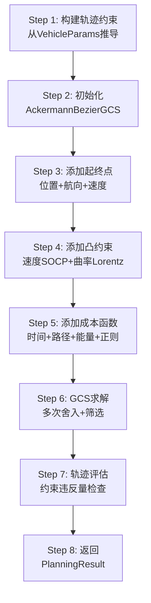

### 6.3 微分平坦映射

阿克曼转向车辆具有**微分平坦性**（Differential Flatness），其全部状态和输入可由平坦输出（位置 $(x, y)$）及其有限阶导数确定：

**映射关系**：位置轨迹 (x, y) 及其一阶导 (ẋ, ẏ) 和二阶导 (ẍ, ÿ) 可完全确定车辆状态空间的所有变量——航向角 θ = arctan2(ẏ, ẋ)、速度 v = √(ẋ²+ẏ²)、曲率 κ = (ẋÿ-ẏẍ)/(ẋ²+ẏ²)^(3/2)、转向角 δ = arctan(L·κ)、加速度 a = (ẋẍ+ẏÿ)/v。

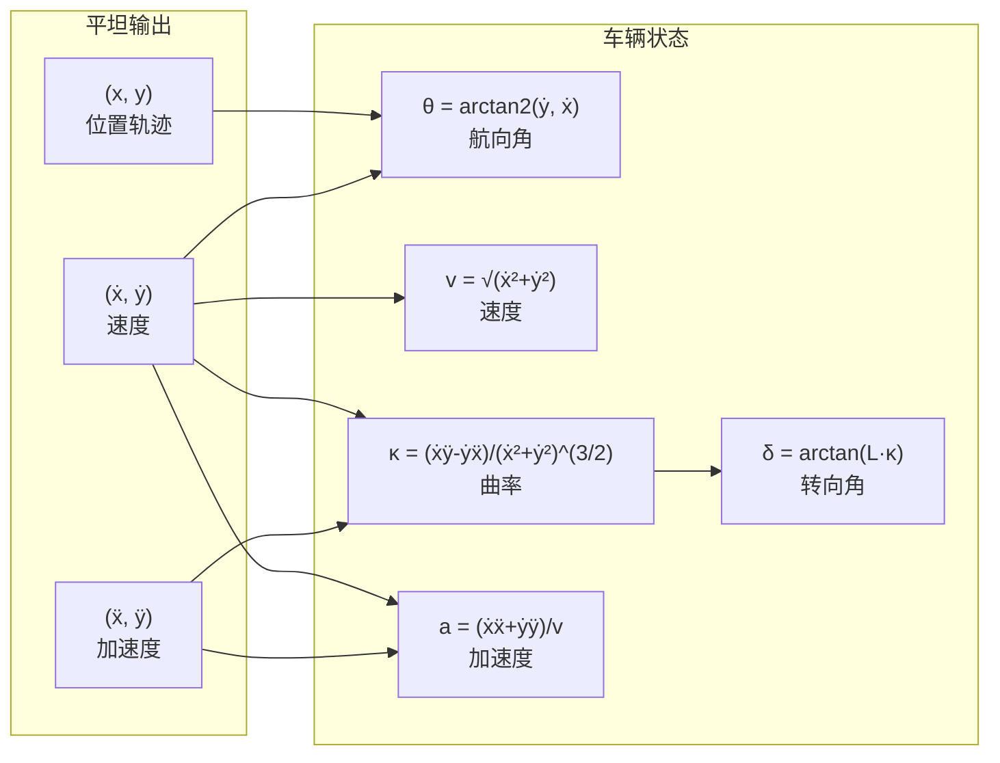

**平坦映射的工程意义**：将5维状态空间 $(x, y, \theta, v, \delta)$ 的规划问题降维为2维平坦输出 $(x, y)$ 的规划问题，大幅减少优化变量数量。约束通过平坦映射的逆映射施加在 $(x, y)$ 空间。

### 6.4 数据结构体系

阿克曼模块的核心数据结构：

- **VehicleParams**：车辆物理参数（轴距、最大转向角、最大速度），自动推导最大曲率和最小转弯半径
- **EndpointState**：起终点状态，包含位置 (2D 向量)、航向角和速度
- **TrajectoryConstraints**：轨迹约束，包含最大/最小速度、最大曲率、h_bar_prime 估计值和曲率约束模式
- **BezierConfig**：贝塞尔曲线配置，包含阶数（默认5）、连续性阶数（默认1）、时间导数下界和最大舍入尝试次数
- **PlanningResult**：规划结果，包含成功标志、轨迹、评估报告、求解时间和收敛原因
- **TrajectoryReport**：轨迹评估报告，包含可行性标志、各维度约束违反量和 C0/C1/C2 连续性检查结果

PlanningResult 引用 TrajectoryReport 和 VehicleParams。

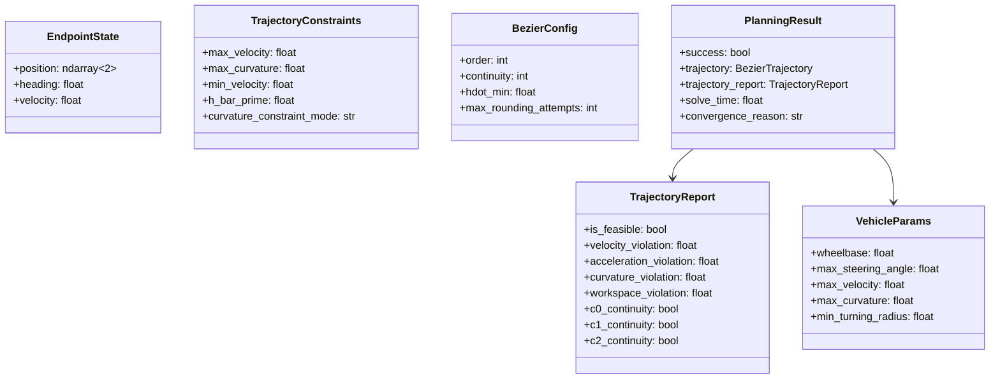

### 6.5 轨迹评估器

`TrajectoryEvaluator` 在求解后对轨迹进行全面评估：

| 评估维度 | 检查内容 | 判定标准 |
|----------|----------|----------|
| 速度可行性 | $\|v(t)\| \leq v_{max}$ | 最大违反量 < $\epsilon$ |
| 加速度可行性 | $\|a(t)\| \leq a_{max}$ | 最大违反量 < $\epsilon$ |
| 曲率可行性 | $\|\kappa(t)\| \leq \kappa_{max}$ | 最大违反量 < $\epsilon$ |
| 工作空间可行性 | 轨迹点在凸区域内 | 所有点在区域内 |
| C0连续性 | 位置连续 | 间断量 < $\epsilon$ |
| C1连续性 | 速度连续 | 间断量 < $\epsilon$ |
| C2连续性 | 加速度连续 | 间断量 < $\epsilon$ |

---

## 7. 分层规划器模块 (`path_planner`)

### 7.1 HybridAStarGCSPlanner 协调逻辑

**4阶段协调流程**：

1. **Phase 1（走廊生成）**：HybridAStarGCSPlanner 调用 CorridorGenerator.generate_corridor(path, robot)，得到 CorridorResult
2. **Phase 2（凸分解）**：若配置为 IRIS 模式，调用 IRIS 引擎的 generate_from_path；若为传统模式，调用 binary_map_to_convex_obstacles 进行 OpenCV 凸分解
3. **Phase 3（GCS优化）**：优先尝试阿克曼 GCS 模式（5维规划），失败则回退到 2D BezierGCS 模式
4. **Phase 4（可视化）**：调用 Visualizer 输出结果图形

最终返回 PlannerResult 给用户。

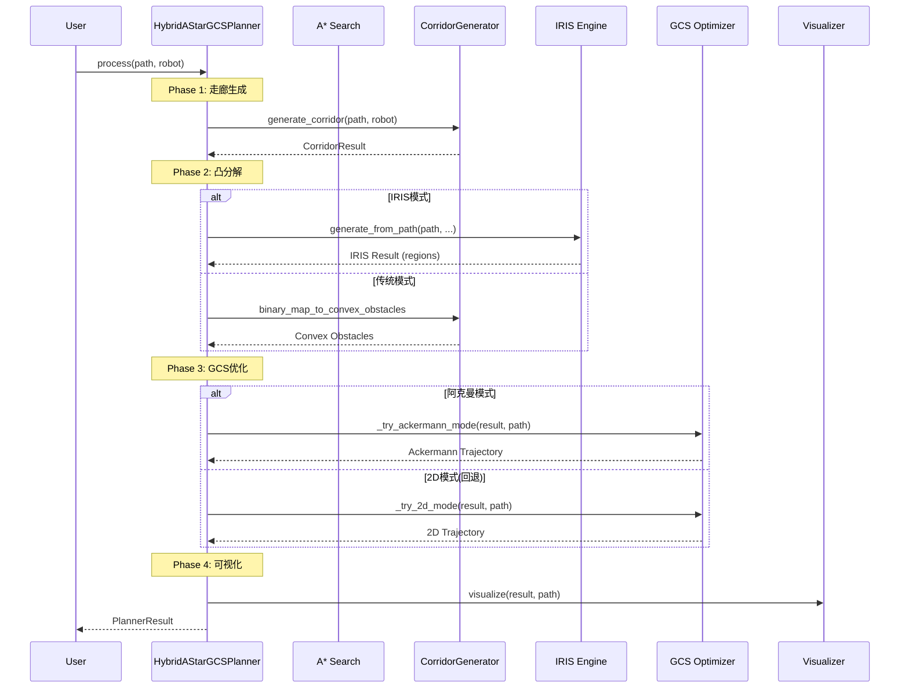

### 7.2 优先-回退策略矩阵

| 阶段 | 优先策略 | 回退策略 | 触发条件 |
|------|----------|----------|----------|
| 凸分解 | IrisZo | IrisNp | IrisZo失败或配置指定 |
| 凸分解 | IRIS | 传统OpenCV分解 | IRIS失败 |
| GCS优化 | 阿克曼GCS (5D) | 2D BezierGCS | 阿克曼求解失败 |
| 求解器 | MOSEK | Gurobi > CLP > SCS | 许可证不可用 |

### 7.3 性能监控

`PerformanceMonitor` 采用**栈式追踪**模式，支持嵌套阶段的性能监测：

```
total_planning (1250ms)
  ├── corridor_generation (120ms)
  │   ├── path_smoothing (15ms)
  │   └── mask_generation (105ms)
  ├── iris_decomposition (800ms)
  │   ├── seed_extraction (10ms)
  │   ├── region_expansion (650ms)
  │   └── coverage_validation (140ms)
  └── gcs_optimization (330ms)
      ├── problem_construction (30ms)
      └── solving (300ms)
```

---

## 8. 设计模式汇总

| 设计模式 | 应用位置 | 实现方式 | 解决的问题 |
|----------|----------|----------|------------|
| 模板方法 | `BaseSE2Planner.plan`, `BaseGCS.solveGCS`, `HybridAStarGCSPlanner.process` | 基类定义算法骨架，子类实现具体步骤 | 算法结构复用，步骤可定制 |
| 策略模式 | `GCSOptimizer`(2D/阿克曼), `IrisNpProcessor`(串行/并行), `BaseGCS`舍入 | 运行时选择算法实现 | 算法可替换，避免条件分支 |
| 协调者 | `IrisNpRegionGenerator`, `IrisZoRegionGenerator`, `AckermannGCSPlanner` | 协调多个子模块完成复杂流程 | 解耦子模块间的直接依赖 |
| 建造者 | `AckermannGCSPlanner`(8步构建), `PlannerConfig`(预设+覆盖) | 逐步构建复杂对象 | 复杂对象的分步构造 |
| 栈式追踪 | `PerformanceMonitor` | 嵌套上下文管理器 | 多层级性能分析 |
| 接口一致性 | `IrisNpRegionGenerator` vs `IrisZoRegionGenerator` | 相同的 `generate_from_path` 签名 | 模块可互换 |
| 优先-回退 | `HybridAStarGCSPlanner` | try-except + 条件判断 | 鲁棒性保证 |
| 延迟导入 | 所有 `__init__.py` | `__getattr__` 机制 | 避免循环依赖，加速加载 |
| 适配器 | `AckermannGCSVisualizer` | 旧接口委托到新实现 | 向后兼容 |

---

## 9. 结论

六大核心模块各司其职，通过清晰的接口边界和设计模式实现了高内聚低耦合。A*模块提供拓扑可行性，C_space模块实现空间局部化，IRIS模块完成凸化，GCS模块执行凸优化，阿克曼模块整合车辆动力学，path_planner模块协调全局流程。模块间通过数据结构（`SearchNode`, `IrisNpRegion`, `BezierTrajectory`, `PlanningResult`）传递信息，避免了控制流层面的紧耦合。设计模式的运用（模板方法、策略、协调者、优先-回退）使得系统在保持架构清晰的同时具备良好的可扩展性和鲁棒性。
