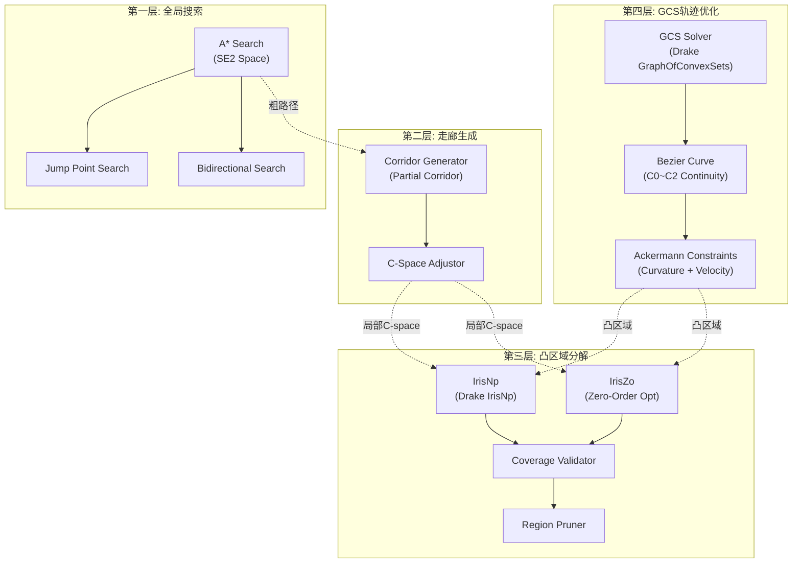
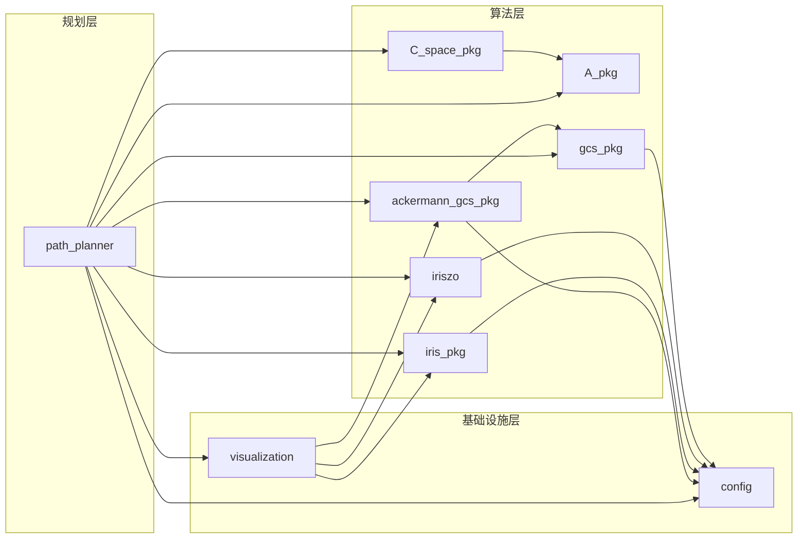
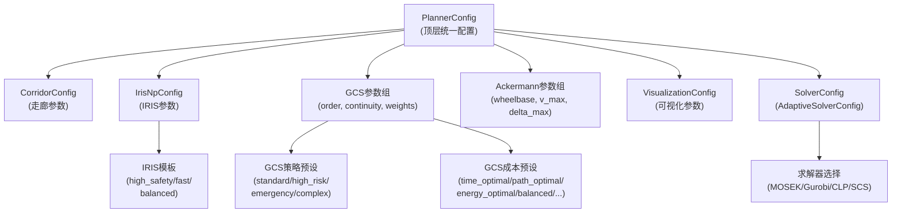
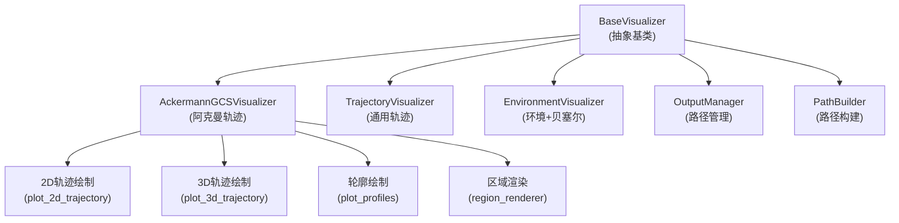

# Ackermann GCS Planner 系统架构分析报告

> **版本**: 2.0.1  
> **分析日期**: 2026-04-18  
> **分析范围**: 全系统架构、分层设计、模块间耦合关系、设计哲学

---

## 1. 引言

本报告对 Ackermann GCS Planner（阿克曼转向车辆轨迹规划系统）进行系统级架构分析。该系统基于 MIT Drake 框架，采用**四层分层规划架构**，将复杂的非凸轨迹规划问题分解为可依次求解的凸优化子问题。本报告聚焦于架构的宏观结构、分层逻辑、模块间耦合关系以及设计决策背后的权衡考量。

---

## 2. 系统总体架构

### 2.1 架构范式

本系统采用**分层递进式架构**（Hierarchical Progressive Architecture），其核心思想是：将一个高维非凸的轨迹规划问题，通过逐层降维和凸化，最终转化为可在多项式时间内求解的凸优化问题。

**四层架构总览**（自底向上）：

- **第一层（全局搜索）**：A* 搜索器在 SE(2) 空间中寻找粗路径，支持跳跃点搜索和双向搜索两种优化策略
- **第二层（走廊生成）**：基于 A* 粗路径生成局部走廊，将走廊外空间设为障碍，实现空间局部化
- **第三层（凸区域分解）**：使用 IrisNp（Drake 原生）或 IrisZo（零阶优化自定义实现）在走廊内生成凸区域，经覆盖验证和区域修剪后输出
- **第四层（GCS 轨迹优化）**：基于贝塞尔曲线和凸集图（Graph of Convex Sets）求解最优轨迹，施加阿克曼车辆的曲率和速度约束

层间数据传递关系：A* 输出粗路径给走廊生成；走廊生成输出局部 C-space 给 IRIS 凸分解；IRIS 输出凸区域列表给 GCS 优化。

### 2.2 四层架构详解

| 层次 | 名称 | 核心模块 | 输入 | 输出 | 复杂度 |
|------|------|----------|------|------|--------|
| L1 | 全局路径搜索 | `A_pkg` | 障碍物地图、起终点 | SE(2)粗路径 | $O(n \log n)$ |
| L2 | 走廊生成 | `C_space_pkg` | 粗路径、机器人形状 | 局部C-space | $O(m \cdot w)$ |
| L3 | 凸区域分解 | `iris_pkg` / `iriszo` | 局部C-space | 凸区域列表 | $O(k \cdot T_{iris})$ |
| L4 | GCS轨迹优化 | `gcs_pkg` / `ackermann_gcs_pkg` | 凸区域、约束 | 最优轨迹 | $O(V \cdot T_{socp})$ |

其中 $n$ 为搜索空间大小，$m$ 为路径段数，$w$ 为走廊宽度，$k$ 为种子点数，$T_{iris}$ 为单次IRIS迭代耗时，$V$ 为GCS顶点数，$T_{socp}$ 为SOCP求解耗时。

---

## 3. 模块架构详析

### 3.1 模块依赖拓扑

系统模块分为三个层次：

- **规划层**（`path_planner`）：顶层协调器，依赖所有算法层模块和基础设施层模块
- **算法层**（`A_pkg`, `C_space_pkg`, `iris_pkg`, `iriszo`, `gcs_pkg`, `ackermann_gcs_pkg`）：核心算法实现，其中 `ackermann_gcs_pkg` 依赖 `gcs_pkg`，`C_space_pkg` 依赖 `A_pkg`
- **基础设施层**（`config`, `visualization`）：被所有模块依赖，提供配置管理和可视化输出

关键依赖链：`path_planner` → `ackermann_gcs_pkg` → `gcs_pkg` → `config`；`path_planner` → `iris_pkg`/`iriszo` → `config`；`path_planner` → `C_space_pkg` → `A_pkg`

### 3.2 模块职责矩阵

| 模块 | 核心职责 | 依赖方向 | 可替换性 | 关键接口 |
|------|----------|----------|----------|----------|
| `A_pkg` | SE(2)空间A*路径搜索 | 被依赖 | 高（可替换为RRT*等） | `plan(start, goal) -> path` |
| `C_space_pkg` | 配置空间生成与走廊构建 | 依赖A_pkg | 中 | `generate_corridor(path, robot)` |
| `iris_pkg` | Drake IrisNp凸区域生成 | 被依赖 | 高（与iriszo互换） | `generate_from_path(path, ...)` |
| `iriszo` | 零阶优化凸区域生成 | 被依赖 | 高（与iris_pkg互换） | `generate_from_path(path, ...)` |
| `gcs_pkg` | 通用GCS求解框架 | 被依赖 | 低（核心算法） | `solveGCS() -> (path, result)` |
| `ackermann_gcs_pkg` | 阿克曼车辆GCS规划 | 依赖gcs_pkg | 中 | `plan_trajectory(source, target, ...)` |
| `config` | 统一配置管理 | 被所有模块依赖 | 低 | 预设模板系统 |
| `visualization` | 可视化输出 | 依赖规划结果 | 高 | `visualize(result, path)` |

### 3.3 关键架构决策与权衡

#### 决策1: 双IRIS引擎设计

**问题**: IrisNp（Drake原生）精度高但依赖Drake内部实现；IrisZo（自定义）灵活可控但收敛性需验证。

**决策**: 采用**优先-回退策略**（Primary-Fallback），IrisZo优先，IrisNp回退。

**权衡**: 
- 优势：兼顾灵活性与鲁棒性，IrisZo失败时自动降级
- 代价：双引擎维护成本，接口一致性约束限制了各自特性的发挥
- 设计约束：两个引擎必须保持 `generate_from_path` 接口一致

#### 决策2: 走廊约束而非全局约束

**问题**: 在全局C-space中直接进行凸分解，区域数量多且包含大量无关区域。

**决策**: 先基于A*路径生成局部走廊，仅在走廊内进行凸分解。

**权衡**:
- 优势：大幅减少凸区域数量，加速后续GCS求解；避免远离路径的冗余区域
- 代价：走廊宽度参数敏感，过窄导致覆盖失败，过宽丧失局部性优势
- 风险：A*路径质量直接影响走廊质量，劣质路径可能导致走廊生成失败

#### 决策3: 贝塞尔曲线而非样条插值

**问题**: GCS中路径表示方式的选择影响约束凸性和求解效率。

**决策**: 采用贝塞尔曲线作为GCS顶点内的路径表示。

**权衡**:
- 优势：贝塞尔曲线的凸包性质保证约束的凸性；导数计算有解析公式；与Drake GCS框架天然兼容
- 代价：高阶贝塞尔曲线的自由度随阶数快速增长；局部控制性弱于B样条
- 关键约束：曲率约束的非凸性通过Lorentz锥松弛为凸约束，引入近似误差

#### 决策4: 分层规划而非端到端优化

**问题**: 是否将A*搜索和GCS优化统一为一个优化问题？

**决策**: 保持分层架构，A*负责拓扑可行性，GCS负责动力学最优性。

**权衡**:
- 优势：各层问题规模可控；A*保证全局拓扑正确性；GCS在凸区域内保证局部最优性
- 代价：分层间信息传递有损（A*路径离散化丢失连续信息）；无法保证全局最优
- 理论依据：分层规划在计算复杂度上具有本质优势，端到端非凸优化的收敛性无保证

---

## 4. 配置架构

### 4.1 配置层次结构

配置系统以 `PlannerConfig` 为顶层统一入口，向下派生出六组子配置：

1. **CorridorConfig**：走廊宽度、平滑开关、边界余量
2. **IrisNpConfig / IrisZoConfig**：IRIS 算法参数，支持三种安全模板（高安全/快速/平衡）
3. **GCS 参数组**：贝塞尔阶数、连续性阶数、成本权重，进一步细分为策略预设和成本预设
4. **Ackermann 参数组**：车辆轴距、最大速度、最大转向角，推导出最大曲率和最小转弯半径
5. **AdaptiveSolverConfig**：求解器选择（MOSEK/Gurobi/CLP/SCS）及容差参数
6. **VisualizationConfig**：输出维度、格式、路径等

### 4.2 预设系统设计

配置系统采用**预设-覆盖**模式（Preset-Override Pattern）：

1. **策略预设**（GCS Strategy Preset）：定义求解策略组合（舍入次数、预处理开关等）
2. **成本预设**（GCS Cost Preset）：定义成本函数权重组合（时间/路径/能量/正则化）
3. **安全模板**（IRIS Template）：定义IRIS算法的安全等级（高安全/快速/平衡）

用户可通过预设快速配置，也可通过覆盖特定参数进行微调。这种设计在**易用性**和**灵活性**之间取得了平衡。

---

## 5. 可视化架构

### 5.1 可视化层次

可视化系统以 `BaseVisualizer` 抽象基类为根，派生出三个具体可视化器：

- **AckermannGCSVisualizer**：阿克曼轨迹可视化，包含 2D 轨迹绘制、3D 轨迹绘制、速度/曲率轮廓绘制、凸区域渲染四个子功能
- **TrajectoryVisualizer**：通用轨迹可视化
- **EnvironmentVisualizer**：环境与贝塞尔曲线可视化

所有可视化器共享 `OutputManager`（路径管理）和 `PathBuilder`（路径构建）两个基础设施组件。

### 5.2 输出管理

可视化系统通过 `OutputManager` 和 `PathBuilder` 管理输出路径，支持：
- 2D/3D维度自动分流
- 运行ID（run_id）隔离不同实验的输出
- 多格式输出（PNG/PDF/SVG）

---

## 6. 非功能性架构特征

### 6.1 性能优化策略

| 策略 | 应用位置 | 机制 |
|------|----------|------|
| Numba JIT | `C_space_pkg` | `@jit(nopython=True, parallel=True)` 加速碰撞检测 |
| 距离场两级筛选 | `SE2ConfigurationSpace` | 外接圆快速排除 / 内切圆快速确认 |
| RTree空间索引 | `RegionPruner` | 加速区域重叠查询 |
| 缓存机制 | `BaseSE2Planner`, `SE2ConfigurationSpace` | 碰撞检测结果缓存 |
| 并行处理 | `IrisNpProcessor` | `ProcessPoolExecutor` 并行膨胀 |
| 延迟导入 | 所有 `__init__.py` | 避免循环依赖，加速模块加载 |
| 向量化计算 | `GCSOptimizer` | NumPy向量化替代循环 |

### 6.2 鲁棒性设计

| 机制 | 应用位置 | 说明 |
|------|----------|------|
| 优先-回退 | `HybridAStarGCSPlanner` | IrisZo优先，IrisNp回退；阿克曼GCS优先，2D GCS回退 |
| 多轮覆盖补充 | `IrisNpRegionGenerator` | 三轮扩张确保路径完全覆盖 |
| 自适应求解器 | `AdaptiveSolverConfig` | 根据问题规模自动选择求解器 |
| 数值安全工具 | `numerical_safety_utils` | 防止除零、数值溢出 |
| 轨迹评估 | `TrajectoryEvaluator` | 求解后验证约束满足度 |

### 6.3 可扩展性

| 扩展点 | 机制 | 示例 |
|--------|------|------|
| 搜索算法 | 继承 `BaseSE2Planner` | 添加RRT*搜索器 |
| 凸区域生成 | 实现 `generate_from_path` 接口 | 添加新的IRIS变体 |
| GCS路径表示 | 继承 `BaseGCS` | 添加B样条GCS |
| 舍入策略 | 传入函数给 `setRoundingStrategy` | 自定义舍入逻辑 |
| 成本函数 | `CostConfigurator` | 自定义成本权重 |
| 可视化 | 继承 `BaseVisualizer` | 添加新的可视化类型 |

---

## 7. 架构评估

### 7.1 优势

1. **分层解耦**：四层架构各层职责清晰，层间通过数据结构传递信息，耦合度低
2. **策略可替换**：A*搜索、IRIS引擎、GCS模式均可运行时切换
3. **配置驱动**：预设系统降低使用门槛，覆盖机制保留灵活性
4. **鲁棒回退**：多级优先-回退策略保证系统在子模块失败时仍能产出结果
5. **性能分层**：从JIT编译到并行处理，多层级性能优化

### 7.2 潜在改进方向

1. **层间信息损失**：A*路径离散化后传递给走廊生成，连续信息丢失；可考虑传递A*搜索的启发式信息
2. **配置复杂度**：PlannerConfig参数众多（>30个），预设系统虽缓解但未根本解决
3. **错误传播**：上层失败（如A*找不到路径）直接导致后续层无法执行，缺乏部分恢复机制
4. **测试覆盖**：单元测试仅覆盖曲率约束和h_bar_prime，核心规划流程缺乏自动化测试
5. **全局最优性**：分层架构无法保证全局最优，可考虑添加全局优化后处理步骤

---

## 8. 结论

Ackermann GCS Planner 的四层分层架构是一个在**计算可行性**和**解质量**之间的精心权衡。通过将非凸的阿克曼车辆轨迹规划问题分解为A*搜索（拓扑可行性）、走廊生成（空间局部化）、凸分解（凸化）和GCS优化（动力学最优性）四个层次，系统在保证每个子问题可高效求解的同时，通过层间信息传递和优先-回退机制维持了整体鲁棒性。该架构的核心设计哲学是**分而治之、逐层凸化、鲁棒回退**，这在运动规划领域是一种成熟且有效的工程实践。
